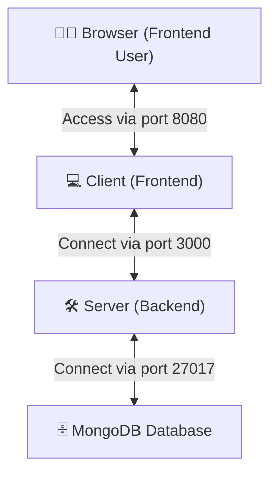

<p align="center">
    
</p>

# RMIT Store 🛒

The RMIT Store is dedicated to selling glorious and wholesome RMIT merchandise, including lanyards, hoodies, T-shirts, cups, and more. It aims to enrich the student experience within the university community by offering a diverse range of services.

Our primary focus is on providing official university apparel and merchandise that fosters a strong sense of identity, inclusivity, and connection among students.

---

## 🔬 What is the MERN Stack?

The MERN stack is a collection of JavaScript-based technologies used to build modern web applications. It consists of:

- **MongoDB**: A NoSQL database for storing application data.
- **Express.js**: A back-end web application framework for Node.js.
- **React**: A front-end library for building dynamic and interactive user interfaces.
- **Node.js**: A runtime environment that executes JavaScript code on the server.

In this project, additional tools and libraries include:

- **Mongoose**: For object modeling with MongoDB.
- **Redux**: For managing the application state.

## 🏪 Features

### For Members (Including Admins):

- **Account Management**:
  - Create a new account or log in securely using email and password.
  - Change account details such as first name, last name, phone, password, and address.

- **Shopping Features**:
  - Browsing different products.
  - Filter products by price and name.
  - Make orders by purchasing products.
  - Check order history.
  - Leave product reviews.
  - Manage wishlist items.

### For Admins:

- **Store Management**:
  - Change, edit, and create products, categories, and brands.
  - Manage user accounts (including members and other admins).
  - Moderate and manage product reviews.

## 🕧 Prerequisites

- **Node.js**: Version 22 or later.
- **MongoDB**: Installed and running locally (for example, MongoDB Community Server) or on cloud (for example, MongoDB Atlas).

## Overview MERN Stack Architecture

Below is an overview of how the components in this architecture are connected:

### Architecture Overview



### Component Connections

1. **Browser**: The user interacts with the frontend of the application (website) via port `8080`.
2. **Frontend (Client)**: Built with **React.js**, the client handles the user interface and connects to the backend server via port `3000`.
3. **Backend (Server)**: Developed using **Node.js** and **Express.js**, the server processes requests from the client and connects to the database.
4. **Database**: The **MongoDB** database stores and retrieves data for the application, communicating with the server via port `27017`.

This clear separation of concerns ensures scalability, flexibility, and modularity in the application.

> **Note**: These port numbers are critical, especially if you plan to run these components as services in containers on different servers. This modular structure supports scalability and can be adjusted based on CI/CD requirements to streamline deployment. 

## 📂 Project Structure

Here is the quick overview of project structure:

```
client/                 # Client-side code (React.js application).
  ├── .env              # Environment variables for the client.
  ├── .env.example      # Example environment variables (backup).
  ├── app/              # Main application code.
  ├── public/           # Public assets.
  │   ├── images/       # Publicly accessible images.
  │   └── index.html    # Entry HTML file for the client.
  ├── webpack/          # Webpack configuration files.
  │   └── webpack.dev.js # Development-specific Webpack configuration.
  └── package.json      # Client dependencies and scripts.

server/                 # Server-side code (Node.js application).
  ├── .env              # Environment variables for the server.
  ├── .env.example      # Example environment variables (backup).
  ├── config/           # Configuration files (e.g., database, server settings).
  ├── middleware/       # Custom Express middleware.
  ├── models/           # Mongoose schemas and models.
  ├── routes/           # Express route handlers.
  ├── utils/            # Utility functions (e.g., helpers).
  ├── index.js          # Server entry point.
  ├── nodemon.json      # Nodemon configuration file.
  └── package.json      # Server dependencies and scripts.

package.json            # Root-level project dependencies and scripts.
.gitignore               # Specifies files and directories to be ignored by Git.
README.md               # Documentation and setup instructions.
```

---

## 📚 Recommended Ways for Beginners to Deploy the Website (From Easy to Hard)

### Plan A: Deploy Locally

**Window, MacOS, or Linux**:
   - Follow the instructions in the "Steps to Build, Configure, and Run the Project Locally" section.

### Plan B: Deploy on AWS EC2 (Single Instance)

1. Follow the instructions in the "Configuring and Deploying the Project on AWS EC2" section to deploy both the client and server on a single EC2 instance.

### Plan C: Deploy on AWS EC2 (Separate Instances)

1. Deploy the client and server on two different EC2 instances.
2. Ensure that the client instance can communicate with the server instance by updating the `API_URL` in the client's `.env` file to point to the server instance's public IP.
3. Configure the EC2 Security Groups to allow the required ports to enable the communication between client and server on different EC2 servers.

Note: you can consider to further seperate the server into the backend and the mongodb into seperate services on different servers. This improves modularity and scalability, making the system easier to manage and expand.

### Plan D: Containerize with Docker

1. Create Dockerfiles for both the client and server.
2. Build Docker images for the client and server.
3. Run the client and server in separate Docker containers in different ec2 servers.

### Plan E: Use Docker Compose

1. Create a `docker-compose.yml` file to define multi-container services.
2. Use Docker Compose to orchestrate the client and server containers.
3. This approach is standard in CI/CD pipelines and team-based development environments.

### Plan F: Upgrade to CI/CD Pipeline

Here are some examples to enhance the CI/CD pipeline of the application:

1. CI/CD Automation: Use tools like Jenkins to automate build, test, and deployment processes.
2. Configuration Management: Utilize Ansible to efficiently manage server configurations.
3. Infrastructure as Code (IaC): Leverage AWS CloudFormation to define and provision cloud infrastructure through code. Automate the setup of AWS resources, including EC2 instances, databases, and S3 buckets, and so on.
4. Container Orchestration: Use Kubernetes or Docker Swarm to deploy and scale containers.
5. Monitoring: Implement Prometheus and Grafana for performance monitoring and alerts.
6. Load Balancing: Incorporate AWS Elastic Load Balancer (ELB) if deploying on AWS.
7. Zero Downtime Deployment: Use Blue-Green Deployment or Canary Deployment strategies for seamless updates without service interruption.
8. Testing Enhancements: Incorporate automated unit, integration, and end-to-end (Web UI) tests into the CI/CD pipeline to ensure comprehensive coverage and robust quality across all application layers.

These ideas can further improve reliability, scalability, and operational efficiency for the project.

**Below are the step-by-step guides for Plan A and Plan B to help you get started. 😊**

---


## 🔧 Plan A: Steps to Build, Configure, and Run the Project Locally

Install Node.js and MongoDB on your local computer based on your operating system. For detailed instructions:

- **Windows**: Download the installers from the [Node.js](https://nodejs.org/) and [MongoDB](https://www.mongodb.com/try/download/community) websites.
- **MacOS**: Use a package manager like Homebrew:
  ```bash
  brew install node mongodb-community
  ```
- **Linux**: Install using your distribution's package manager or download directly from the official sites.

### Step 1: Install Dependencies

At the root of the project, install all dependencies:

```bash
npm install
```

Running `npm install` at the root of the project will install dependencies for both the client and server. Specifically, by running that command, it will automatically:

1. Navigate to the `client` directory and install dependencies listed in `package.json`.
2. Navigate to the `server` directory and install dependencies listed in `package.json`.

Alternatively, for experimentation, you can choose to install dependencies separately for each folder by running `npm install` in the `client` and `server` directories individually. However, for convenience, we recommend running `npm install` at the root to handle both in one go.

### Step 2: Populate the Database

Get started quickly with pre-populated data:

- **Admin User**: Creates an admin user with the provided email and password.
- **Categories**: Seeds categories with random names and descriptions.
- **Brands**: Seeds brands with random names and descriptions.
- **Products**: Seeds products with random details such as SKU, name, description, quantity, price, and image URL. Products are associated with categories and brands.

If you want to seed the MongoDB database with initial data, run the following command. Replace `admin@rmit.edu.vn` and `mypassword` with your desired admin credentials:

```bash
npm --prefix ./server run seed:db admin@rmit.edu.vn mypassword
```

[Optional] You can use MongoDB Compass to explore the database data by connecting to it using the MongoDB URI.


### Step 3: Run the Project

To start the project, at the root of the project, use the following command:

```bash
npm run dev
```

Running `npm run dev` at the root of the project will start for both the client (frontend) and server (backend). Specifically, by running that command, it will automatically:

1. Navigate to the `client` directory and run the command `npm run dev` to start the client.
2. Navigate to the `server` directory and run the command `npm run dev` to start the server.

Alternatively, you can choose to run each of them separately. However, for convenience, we recommend running `npm run dev` at the root to run both in one go.

The website should now be accessible at:

```
http://0.0.0.0:8080 or http://localhost:8080 
```
<p align="center">
    
</p>

After deploying the website, you can create your own account for a normal member to start browsing and buy products, leave reviews, or log in as an admin where you can have more administration rights.

## 🕧 Summary of Commands

Here is a quick reference for the commands to build and populate the project:

```bash
# Install dependencies
npm install

# Populate the database
npm --prefix ./server run seed:db admin@rmit.edu.vn mypassword

# Run the project
npm run dev
```

## 🚀 Plan B: Configuring and Deploying the Project on AWS EC2

### Step 1: Launch an EC2 Instance

1. Log in to the AWS Management Console.
2. Launch a new EC2 instance with the following specifications:
   - Choose the **Amazon Linux 2023 AMI**.
   - Select an instance type (e.g., t2.micro for free-tier eligibility). You might consider temporarily upgrading to a more powerful tier, such as t2.medium, if the free-tier instance is too slow to build the project initially. FYI, the free-tier t2.micro takes around  2 minutes usually to build this project.
   - Configure security groups to allow inbound traffic on ports **3000** (backend) and **8080** (frontend).

### Step 2: Install Node.js and npm

1. Connect to your EC2 instance via SSH.
2. Install Node.js and npm:
   ```bash
   # Install fnm
   curl -fsSL https://fnm.vercel.app/install | bash

   # Activate fnm
   source ~/.bashrc

   # Install and use Node.js version 22
   fnm use --install-if-missing 22

   # Verify Node.js installation
   node -v

   # Verify npm installation
   npm -v
   ```

### Step 3: Install MongoDB

1. Add the MongoDB repository:
   ```bash
   sudo tee /etc/yum.repos.d/mongodb-org-6.0.repo <<EOF
   [mongodb-org-6.0]
   name=MongoDB Repository
   baseurl=https://repo.mongodb.org/yum/amazon/2023/mongodb-org/6.0/x86_64/
   gpgcheck=1
   enabled=1
   gpgkey=https://www.mongodb.org/static/pgp/server-6.0.asc
   EOF
   ```
2. Install MongoDB:
   ```bash
   sudo yum install -y mongodb-org
   ```
3. Start MongoDB:
   ```bash
   sudo systemctl start mongod
   sudo systemctl enable mongod
   ```
4. Verify the installation:
   ```bash
   mongod --version
   ```

### Step 4: Clone the Project and Set It Up

1. Clone your project repository:
   ```bash
   git clone <your-git-repo-url>
   cd COSC2767-RMIT-Store
   ```
2. Install project dependencies:
   ```bash
   npm install
   ```
   For the free-tier EC2 instance, it should take less than 2 minutes to build. If the build process (npm install) is slow for you, consider temporarily upgrading to a higher-tier EC2 instance (e.g., 2 vCPU and 4 GB RAM) to speed up the initial setup. Once completed, you can downgrade to a free-tier instance to save costs.
   
### Step 5: Configure Environment Variables

1. Update the `.env` file for both the client and server to use the public IP address of your EC2 instance.
2. Set the `API_URL` in the `.env` file to point to your EC2 instance:
   ```env
   API_URL=http://<your-ec2-public-ip>:3000/api
   ```

This step ensures that the frontend can communicate with the backend hosted on your EC2 instance. By updating the `API_URL` to the public IP of your EC2 instance, the client application will correctly send API requests to the server. 

### Step 6: Check Security Group Settings

1. Ensure that the security group associated with your EC2 instance allows inbound traffic on:
   - Port 3000 (backend)
   - Port 8080 (frontend)
2. Verify that the environment variables are correctly configured as per the previous step.

### Step 7: Start the Project

Run the project using the standard command:

```bash
npm run dev
```

The frontend should now be accessible at `http://<your-ec2-public-ip>:8080`, and the frontend and backend should communicate properly.

---

## 🌱 Setting Up Environment Variables

To configure additional settings, such as port numbers and endpoint addresses, check the environment variables in the client and server directories (client/.env and server/.env).

Below are examples of .env files for hosting both the client and server on the same machine, such as localhost or an AWS EC2 instance.

### Client `.env` File

**Local Example:**
```
API_URL=http://localhost:3000/api 
```

**AWS EC2 Example:**
```
API_URL=http://<your-ec2-public-ip>:3000/api
```

### Server `.env` File

**Local Example:**
```
PORT=3000
MONGO_URI=mongodb://localhost:27017/rmit_database
JWT_SECRET=my_secret_string
CLIENT_URL=http://localhost:8080
BASE_API_URL=api
```

**AWS EC2 Example (adjust as needed):**
```
PORT=3000
MONGO_URI=mongodb://0.0.0.0:27017/rmit_database  # or MongoDB Atlas URI if using cloud DB
JWT_SECRET=my_secret_string
CLIENT_URL=http://0.0.0.0:8080
BASE_API_URL=api
```

**Important:** Replace `<your-ec2-public-ip>` with your actual EC2 instance's public IP. You can also adjust the value "0.0.0.0" to match the specific public IP addresses required for your pipeline setup.

## 🌐 Configuring Webpack Dev Server

To ensure the webpack dev server is correctly configured for both local and EC2 deployments, update the `devServer` settings in `client/webpack/webpack.dev.js` as follows:

**Local Deployment:**
```javascript
devServer: {
  port: 8080,
  host: 'localhost', // Listen on localhost network
  ...
}
```

**EC2 Deployment:**
```javascript
devServer: {
  port: 8080,
  host: '0.0.0.0', // Listen on all interface network
  ...
}
```

This configuration ensures that the webpack dev server listens on the appropriate network interface based on the deployment environment.


The `client/` and `server/` directories are isolated, promoting independent development and deployment.

## 🔐 Developer Notes

- Ensure that MongoDB is running locally or that your MongoDB Atlas cluster is properly configured.
- The client communicates with the server via the `/api` endpoint.
- Make sure the `.env` files are properly set up for both the client and server.

## 🏆 Author
- Tom Huynh - tomhuynhsg@gmail.com
